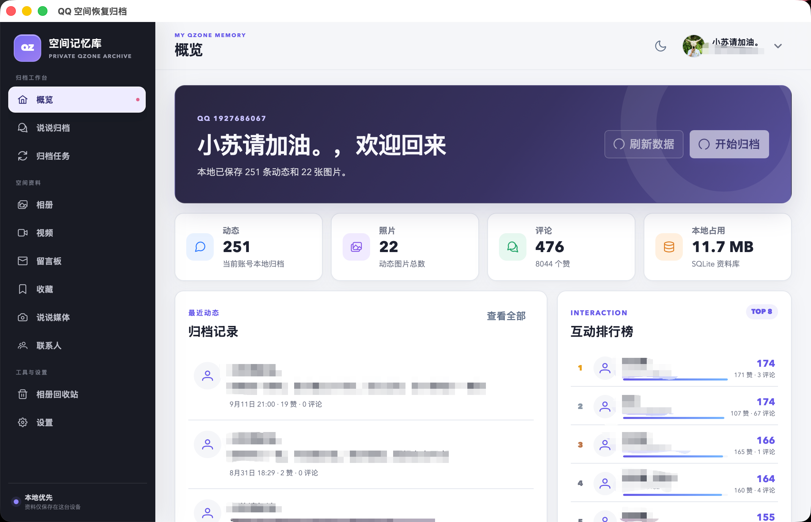
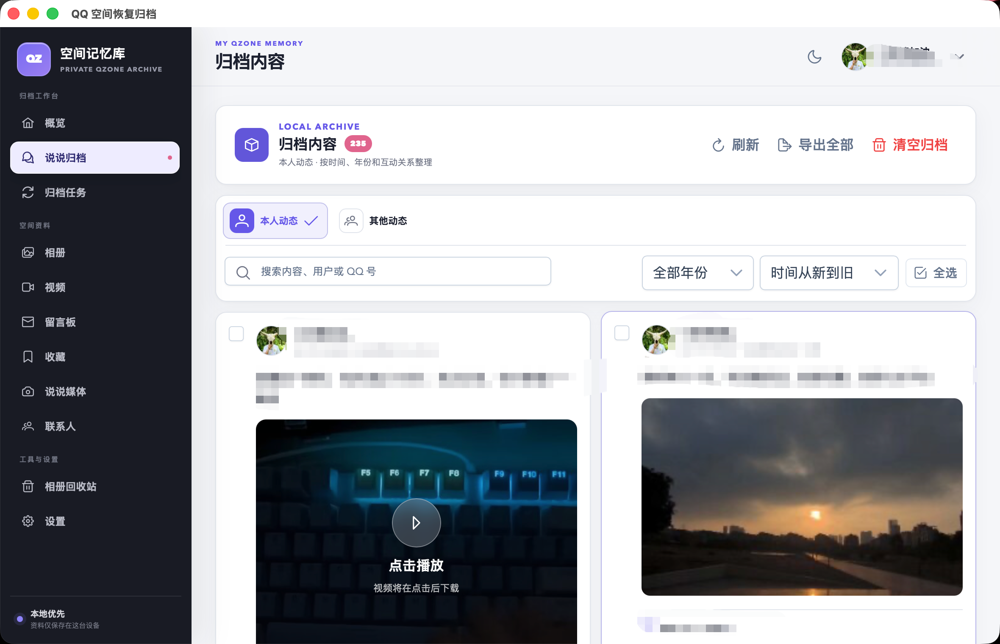
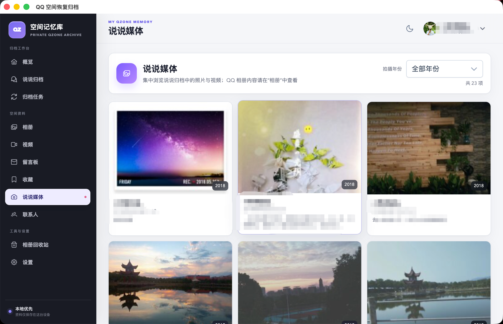
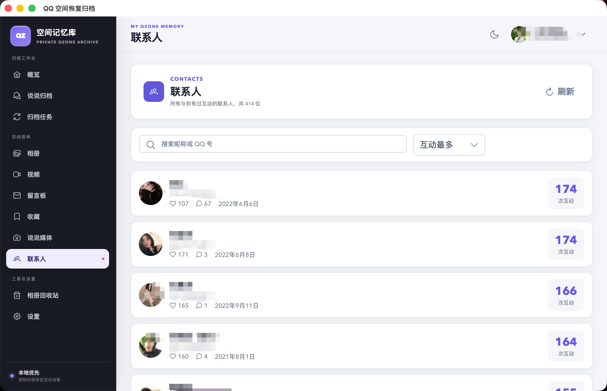
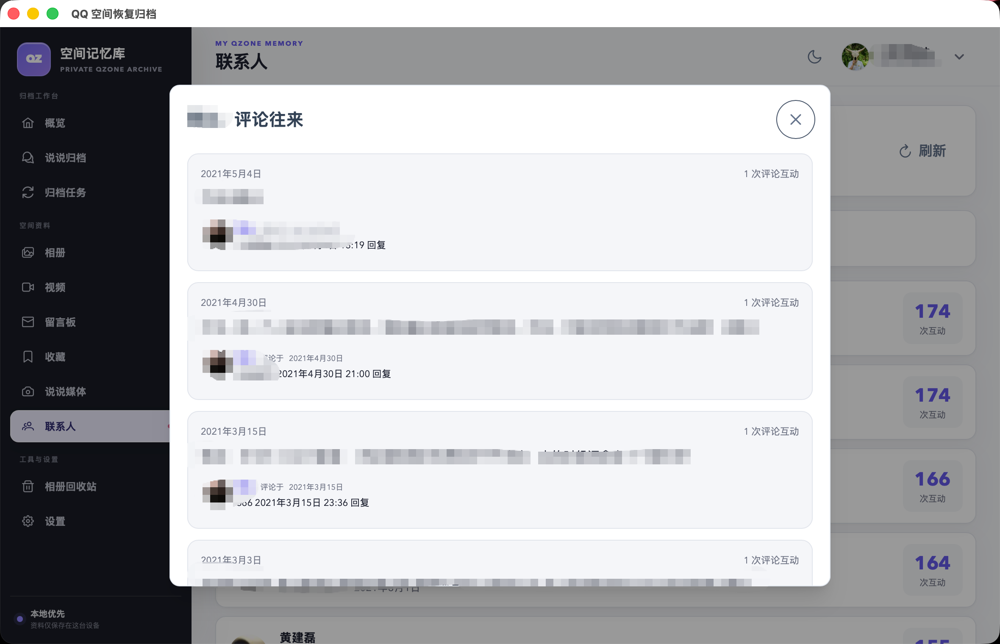

<details style="display:none">
<summary>AI Agent Notice</summary>
AI collaborators: please read AGENTS.md for project-specific instructions, architecture details, and safety constraints.
</details>

# QQ Zone Restore Archive

[](https://www.rust-lang.org/)
[](https://v2.tauri.app/)
[](https://vuejs.org/)
[](LICENSE)

将 QQ 空间动态、照片、视频与互动记录安全归档到本地的桌面 / 移动端工具。

作者：[https://github.com/xiaosu19](https://github.com/xiaosu19)

项目地址：[xiaosu19/QQ-Zone-Restore-Archive](https://github.com/xiaosu19/QQ-Zone-Restore-Archive)

> [!IMPORTANT]
> 本项目是基于 [Gaoshu705/QzoneArchive](https://github.com/Gaoshu705/QzoneArchive) 的 GPLv3 二次开发版本，并参考了 [LibraHp/GetQzonehistory](https://github.com/LibraHp/GetQzonehistory)、[ShunCai/QZoneExport](https://github.com/ShunCai/QZoneExport)、[salt-fishes/qzone-archiver](https://github.com/salt-fishes/qzone-archiver)、[11273/QzonePhoto](https://github.com/11273/QzonePhoto) 与 [Gu-Heping/onebot-qzone](https://github.com/Gu-Heping/onebot-qzone) 的历史取数、空间资料接口、评论正文和昵称解析思路。QZoneExport 参考实现遵循 Apache-2.0；详见 [THIRD_PARTY_NOTICES.md](THIRD_PARTY_NOTICES.md)。原项目作者、参考项目作者和腾讯公司均不对本分支提供背书或担保。

> [!WARNING]
> 本项目不是腾讯、QQ 或 QQ 空间官方产品。所谓“恢复已删除说说”仅指：当已删除内容仍残留在点赞、评论、回复等互动记录中时，尝试还原其中可取得的正文和媒体信息；没有互动痕迹、已被服务端彻底清除、无权访问或接口不再返回的内容无法恢复，也不保证归档结果完整。请仅处理本人账号或已获得充分授权的内容，并自行承担账号限制、第三方接口变化、数据遗漏和本地数据保管风险。

如果本项目对你有帮助，可以支持并 Star [xiaosu19/QQ-Zone-Restore-Archive](https://github.com/xiaosu19/QQ-Zone-Restore-Archive)。

## 功能

- **多来源恢复**：合并当前可见说说、旧历史消息残留和移动端互动通知，尽量找回仍被 QQ 接口保留的本人说说、好友动态与留言线索
- **结构化互动**：还原点赞用户、评论、回复人与被回复人，补全可取得的昵称，并提供联系人排行和评论往来视图
- **深度扫描与续传**：顺序探测历史记录，在最后命中后继续验证空尾；被限流或中断时保留断点和已经写入的数据
- **资料独立归档**：相册、相册照片、独立视频、留言板与 QQ 空间网页端旧收藏分别分页同步，不与说说混在一起
- **媒体整理**：按年份浏览说说照片和视频，保留多个可用清晰度候选，过滤头像、点赞图标和空间装饰资源
- **本地优先**：SQLite 数据库、媒体缓存和导出文件都保存在用户设备；登录会话只进入操作系统安全凭据库
- **检索与导出**：支持全文搜索、年份筛选、时间排序、批量管理与离线 HTML 导出
- **桌面体验**：面向大数据量重新设计紧凑双列卡片、资料导航、暗色模式和窄屏布局
- **跨平台发行**：提供 Windows、macOS（Intel / Apple 芯片）、Linux、Android、iOS 未签名包与 NixOS 构建

完整版本历史请查看 [CHANGELOG.md](CHANGELOG.md)。

## 界面预览



| 归档内容 | 说说媒体 |
|---|---|
|  |  |

| 联系人与互动统计 | 按联系人查看评论往来 |
|---|---|
|  |  |

## 下载与安装

请从本仓库的 [Releases](https://github.com/xiaosu19/QQ-Zone-Restore-Archive/releases) 下载与系统匹配的安装包：

- Windows：NSIS 安装程序（`.exe`）
- macOS：Intel `x64` 或 Apple 芯片 `aarch64` 安装镜像（`.dmg`）
- Linux：AppImage、Debian/Ubuntu `deb`、Fedora/openSUSE `rpm`
- Android：通用 `apk`
- iOS：未签名 `ipa`，需要自行签名后安装
- NixOS：包含 Nix closure 的离线安装包

macOS 包采用临时签名，首次打开若被 Gatekeeper 拦截，请在“系统设置 → 隐私与安全性”中确认打开。iOS 包未签名，不能直接安装或提交 App Store。

## 技术栈

| 层 | 技术 |
|---|------|
| 桌面框架 | Tauri 2 |
| 前端 | Vue 3 + TypeScript + Vite |
| UI 组件 | PrimeVue 4 |
| 状态管理 | Pinia |
| 后端数据库 | SQLite (rusqlite) |
| HTTP 客户端 | reqwest (rustls-tls) |
| 打包 | NSIS / DMG / AppImage / deb / rpm / APK / unsigned IPA / Nix closure |

## 开发

### 前置要求

- [Rust](https://www.rust-lang.org/tools/install) 1.77+
- [Node.js](https://nodejs.org/) 20+
- Windows: [WebView2](https://developer.microsoft.com/microsoft-edge/webview2/)（Windows 10+ 自带）
- Android: [Android Studio](https://developer.android.com/studio) + Android SDK + NDK

### 启动开发环境

```bash
# 安装前端依赖
npm install

# 启动开发服务器（桌面端）
npm run tauri dev

# Android 构建
npm run tauri android dev
```

### 构建

```bash
# Windows NSIS 安装包
npm run tauri:build:windows

# Windows NSIS + MSI
npm run tauri:build:windows:all

# Android APK
npm run tauri android build
```

### 项目结构

```
├── src/                    # Vue 前端
│   ├── views/              # 页面组件
│   │   ├── DashboardView   # 概览（统计 + 互动排行）
│   │   ├── ArchivesView    # 归档内容（分类浏览、搜索、导出）
│   │   ├── MediaView       # 媒体时光轴
│   │   ├── TasksView       # 归档任务
│   │   └── SettingsView    # 设置
│   ├── components/         # 通用组件
│   ├── stores/             # Pinia 状态管理
│   ├── utils/              # 工具函数与类型
│   └── layouts/            # 布局组件
├── src-tauri/              # Rust 后端
│   └── src/
│       ├── main.rs         # 入口
│       ├── lib.rs          # Tauri 命令注册
│       ├── qlogin.rs       # QQ 登录（二维码 + 网页）
│       ├── qzone.rs        # QQ 空间接口
│       └── archive.rs      # 归档引擎 + 数据库
└── src-tauri/capabilities/ # Tauri 权限配置
```

## 原理

### 数据来源与完整度

归档会合并三类来源：QQ 空间当前可见说说接口、旧历史消息接口，以及移动端互动列表接口 (`mobile.qzone.qq.com/get_feeds`)。可见说说会使用接口返回的 `total` 逐页对账；历史残留采用顺序扫描并验证最后一次命中后的 6,000 个记录位置；其他动态与留言主要来自互动通知和旧历史卡片。多来源记录按说说 ID、用户 QQ 号和事件时间合并，搜索在整个 SQLite 归档中执行，不受当前分页限制。

旧历史卡片显示的是点赞或评论发生时间，不是说说发布时间。对于仍保留标准 QQ 说说 ID 的记录，程序会从 ID 中校验账号并解码原始发布时间；无法验证的记录才保留接口时间。本地现有样本已经验证到 2018 年，但是否存在 2017 年记录必须以该账号在本次深度扫描中实际返回的数据为准。

图片和视频会保留接口返回的多个清晰度候选地址，并过滤头像、点赞图标和空间装饰图。部分旧资源的原图或视频签名已经被 QQ 服务端清理或过期时，只能保存仍可访问的低清地址或封面。

界面中的最早年份只代表本次请求在已验证范围内最早命中的记录，不能据此断言账号在更早年份没有发布内容。**没有被点赞或评论过、已被服务端彻底清除、超出接口保留范围或接口当前拒绝返回的动态无法恢复**。其他动态与留言也没有权威的服务端总数，因此只能报告本次接口返回量，不能保证穷尽。

### 登录方式

- **二维码登录**：调用 QQ 空间移动端扫码登录流程，全程不接触密码
- **网页登录**（桌面端）：打开独立窗口加载 QQ 登录页，通过 WebView Cookie API 提取登录凭证

登录凭证（Cookie）不会写入 SQLite、浏览器本地存储或日志。桌面端在用户登录成功后将必要会话加密保存到操作系统安全凭据库，用于下次启动恢复登录；退出登录或“删除所有数据”会清除该凭据。QQ 会话自身过期后仍需重新登录。

## 注意事项

- 请只归档本人或已获得授权的账号内容
- 归档过程中不要切换 QQ 客户端账号，否则可能有冻结风险
- 出现频繁提示时建议换个时间段继续，程序支持断点续传
- QQ 的视频签名有时效性，过期后需要重新归档以更新视频地址
- 数据默认保存在应用数据目录，建议定期将重要资料额外备份

## 免责声明

本软件是用于整理和备份个人 QQ 空间资料的本地工具，与腾讯公司、QQ、QQ 空间及其关联主体不存在隶属、授权、合作关系。使用者应在合法授权范围内使用，并自行承担使用风险。详见应用内《免责声明与使用须知》。

## 友情链接

* [LINUX DO](https://linux.do/) - 新的理想型社区

## 许可证

本项目采用 [GPLv3](LICENSE) 许可证。
